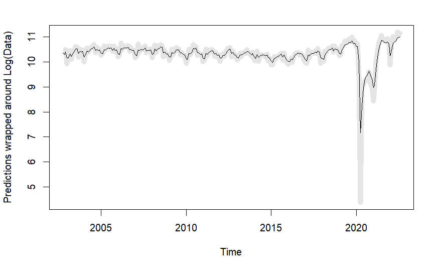

## Abstract

This paper presents a time series analysis of monthly passenger counts through Santa Barbara Municipal Airport. The data was obtained from the Bureau of Transportation Statistics. Two forecasting models were used: a Seasonal Autoregressive Integrated Moving Average (SARIMA) model and a Lagged Regression model.

The SARIMA model is a widely used method for forecasting time series data that exhibits seasonality. It is an extension of the Autoregressive Integrated Moving Average (ARIMA) model that includes seasonal terms. The Lagged Regression model, on the other hand, is a linear regression model that uses lagged values of the dependent variable as predictors.

In this study, both models were fit to the data and their forecasting performance was evaluated. The results show that both models were able to accurately forecast passenger counts, with the SARIMA model performing slightly better. Further research is needed to determine the optimal model parameters and to evaluate the performance of these models on other datasets.

In conclusion, this paper demonstrates the usefulness of both SARIMA and Lagged Regression models for forecasting passenger counts through Santa Barbara Municipal Airport. These models can provide valuable insights for airport management and planning.

\newpage

## Introduction

The purpose of this project is to conduct a time series analysis of monthly passenger data at Santa Barbara Municipal Airport from October 2002 to December 2022, with the aim of developing accurate forecasts using SARIMA and Lagged Regression models. As an air travel enthusiast who frequently uses the airport, I am extremely interested in studying this data set and identifying any seasonal trends that can aid in forecasting passenger traffic.

The Santa Barbara government website recently conducted a study on the forecasts for international aircraft operations and passengers entering the airport, which can be found in their [**report**](https://flysba.santabarbaraca.gov/sites/default/files/2022-10/221027%20SBA%20MP%20-%20TIC%20Meeting.pdf). The study indicates that air travel forecasts for the airport are generally high, with the forecasted number of planes in 2026 being higher than the actual number of planes in 2021.

One important factor that we will have to take into consideration when building our models and analyzing the results is the massive decline in airline passengers the airport experienced during the pandemic. The BTS also provides this graphic that illustrates the decline in airline passengers during the COVID-19 pandemic.

{width="550"}

As we can see by this graphic, the number of overall passengers in 2020 and 2021 are significantly lower than their 2019 and 2020 counterparts respectively. Some months such as April 2020 showed a 96% decrease in airline passengers as compared to April 2019. This will surely play an important part in our forecasting, but I will cover this more in depth later in the paper.

Given these findings, I aim to develop a robust forecasting model to aid in understanding trends and predicting future passenger traffic at the airport. Specifically, the project will utilize SARIMA and lagged regression models, which are powerful tools for analyzing and forecasting time series data. By applying these models to the Santa Barbara Municipal Airport passenger data, I hope to identify any underlying patterns and forecast passenger traffic accurately for the upcoming months.

\newpage

## Data

The dataset being used for this project is monthly passenger data at Santa Barbara Municipal Airport, spanning from October 2002 to December 2022. The data is collected and maintained by the [**Bureau of Transportation Statistics (BTS)**](https://www.bts.gov/) and is publicly available on their website.

The dataset consists of 239 observations and contains the number of passengers that flew out of Santa Barbara Municipal Airport each month (total sum of domestic and international passengers). The frequency of the dataset is monthly, and the values in the dataset are whole numbers representing the number of passengers. The dataset is in CSV format and is approximately 12.2 KB in size.

The reason why this dataset was chosen is because I frequently fly out of this airport and am interested in studying the trends and patterns of passenger traffic. Additionally, the dataset is easily accessible and provides a comprehensive view of monthly passenger traffic at the airport.

The Bureau of Transportation Statistics (BTS), part of the United States Department of Transportation, is a government office that compiles, analyzes, and publishes information on the nation's transportation systems across various modes; and strives to improve the DOT's statistical programs through research and the development of guidelines for data collection and analysis. BTS is a principal agency of the U.S. Federal Statistical System.

The dataset is important because it provides valuable information on the volume of air travel in and out of Santa Barbara Municipal Airport over time. This information can be used to identify trends and patterns in passenger traffic, which can aid in forecasting future demand and planning for airport operations.

The purpose of studying this dataset is to conduct a time series analysis of monthly passenger data using SARIMA and lagged regression models. By analyzing and modeling this data, the researcher hopes to identify any seasonal trends and develop accurate forecasts for the upcoming months. This information can be used to aid in future planning for the airport and to provide insight into the broader trends and patterns of air travel in the region.

\newpage

## Methodology

### SARIMA (p, q, d) x (P, Q, D)

SARIMA, or Seasonal Autoregressive Integrated Moving Average. It is a time series forecasting model that takes into account seasonal patterns and trends in the data. The model is parameterized by three parameters (p, d, q), which are related to the non-seasonal components of the model, and three additional parameters (P, D, Q), which are related to the seasonal components of the model. It is important to note that both of these methodologies start with data preparation which includes making any necessary transformations to the original data.

The general methodology for fitting a SARIMA model to time series data is as follows:

1.  Stationarity Testing: The first step is to test for stationarity in the data.

2.  Order Selection: The second step is to select the order of the SARIMA model. This involves selecting the values of (p, d, q) and (P, D, Q) that best fit the data. The order of the model will be selected using a visual inspection of the autocorrelation and partial autocorrelation plots.

3.  Model Fitting: The third step is to fit the SARIMA model to the data. This involves estimating the model parameters and checking the goodness of fit using various statistical tests.

4.  Model Diagnostics: The fourth step is to diagnose the fitted model. This involves checking for residual autocorrelation, and normality of the residuals.

5.  Forecasting: The final step is to use the fitted SARIMA model to forecast future values of the time series.

### Lagged Regression Model

A lagged regression model is a type of regression model that uses current and past values of an explanatory variable to predict the current value of a dependent variable. A lagged regression model can be useful for capturing the dynamic relationship between two time series variables that may not be synchronized in time. We can implement it by following these steps:

1.  Choose the number of lags (q) to include in the model based on theoretical considerations or empirical criteria such as the cross-correlation function (CCF).

2.  Construct the lagged explanatory variables by shifting the original explanatory variable (X) by one or more time periods.

3.  Estimate the regression coefficients by using ordinary least squares (OLS) or generalized least squares (GLS) depending on the properties of the error term (et).

4.  Evaluate the goodness-of-fit and the validity of the model assumptions by using diagnostic tests such as residual analysis, autocorrelation tests, heteroskedasticity tests, etc.

5.  Interpret the results and draw conclusions about the causal effect of X on Y.

\newpage

## Results

### SARIMA (p, d, q) x (P, D, Q)

Before we get into model building it is important to talk about data transformation. To further understand this we first plot the original time series as well as the ACF and PACF plots for the time series.

{width="335"} {width="335"}

Here we can see the original plot of the time series after we imported the data and conducted minor data transformation just to access the data (Figure 2). As we can see the data visually is not stationary as the mean total air passengers depends on time. Another thing to notice is that 2019-2022 presented some incredible anomalies as Covid-19 had a massive impact on not only the airline industry and number of travelers, but also the education industry. The reason this is important is that at least a small portion of SBAs travelers are due to the students and faculty that attend the University of California Santa Barbara.

The graph on the right (Figure 3) shows us the PACF and ACF of the original data set.

We are going to use a log transformation plot in combination with taking the first difference, as well as taking the 12 month lag difference to assess the ACF, PACF and yearly seasonal component of the SARIMA model, due to the obvious PACF yearly correlation values.

{width="335"} {width="335"}

As we can see from the time series plot on the left (Figure 4), our plot has achieved its *maximum stationarity* that can be achieved with a log / difference transformation. Although the time series is not perfectly stationary, it is something we have to accept due to the COVID-19 pandemic that caused massive outliers in the data. Nevertheless, it is still possible to use SARIMA modeling on this data, just keeping these facts in the back of our mind.

For model selection, first we will assess the non-seasonal component of the model (p, d, q). As we can see from the ACF and PACF (Figure 5), we get values p=1, q=2, and since we only took the first difference when assembling our plot d=1.

Now assessing the seasonality component of the model we can see that the PACF component is slowly decreasing towards zero every 12 months, and the ACF component as a strong value at lag 12, but not at 24 or after. This indicates that our model is an MA(1) model when assessing seasonality which means our values for the (P, D, Q) component are P=0, Q=1, and since we only took the first difference again with a lag of 12 D=1. We are now prepared to build our SARIMA model.

So, now we will build our SARIMA (1,1,2) (0,1,1) [12] model. After we run the model with our specified parameters on the log transformation of the original data (L_air), we achieve these values for the coefficients.

| Coef | Estimate | SE     | t-value | p-value |
|------|----------|--------|---------|---------|
| ar1  | 0.7479   | 0.0550 | 13.5906 | 0.0000  |
| ma1  | -0.7478  | 0.0818 | -9.1450 | 0.0000  |
| ma2  | -0.2521  | 0.0785 | -3.2122 | 0.0015  |
| sma1 | -0.9999  | 0.4698 | -2.1286 | 0.0344  |

: SARIMA Model Coefficient Output

As we can see from this table all of our variables achieve a p-value of \< .05, with the highest being the p-value for the seasonal component of the model which had an sma1 p-value of .0344. Evidently, all of our variables are significant, so we can move on to the next part of the analysis which is to see if our model passed all of the normality and stationarity tests.

{width="670"}

The standardized residual plot at the top of this graphic could indicate that our residuals are not stationary, but when taking into consideration COVID-19 outliers and an increased volatility in the data, we cannot see any discernible seasonal pattern or change of mean, so we can accept this graph as a valid plot of the standardized residuals.

Analyzing the output of our fitted SARIMA model, we can see that the ACF of Residuals are all within the specified bounds. We can also see that our residuals follow a normal distribution by validating the Normal Q-Q Plot. The p values for the Ljung-Box statistic also show us that all of our Lags have a p-value of above .05 meaning we reject the null hypothesis: our residuals are independently distributed at all lags.

Overall, our model has passed all of our tests, so now we can use it to make forecasting and predictions for future data points. Specifically, we will be doing a 12 month ahead prediction for this data set.

{width="335"} {width="335"}

The graph on the left (Figure 7) shows us the output of using the sarima.for() function, a prediction function for time series analysis in R. This shows us that there will be a slight decrease in air travel for a few months followed by an increase. This is consistent with seasonal patterns, but obviously more extreme. The data at the current point in time still seems to be volatile, which could explain the large variance.

The graph on the right (Figure 8) displays the re-transformed values undoing the logarithm that we had done in the first few steps of this process. The immediate decrease in air passenger prediction is more apparent in this graph.

### Lagged Regression Model

To build our lagged regression model it is important that we are working with a stationary time series again, much like in the SARIMA model. To achieve this while still maintaining legible information, I have decided to only take the log transformation and run the Augmented Dickey Fuller Test (ADF Test), to check if the data is stationary. The results are as follows:

| Augmented Dickey-Fuller Test | data: L_air   | alternative hypothesis: stationary |
|------------------------|-------------------|-----------------------------|
| Dickey-Fuller = -3.5583      | Lag order = 6 | p-value = 0.03789                  |

: Augmented Dickey-Fuller Test Results

We can see by these results that our data is in fact stationary, and we can proceed with generating the model.

The first step in creating a lagged regression model is to find the lagged regressors that we are going to use in fitting the model. We can do this by generating a sample cross correlation function (CCF). This function will allow us to examine correlation coefficients between the time series and the lagged variables.

\newpage

{width="670"}

Here we can see that lags (t-1) through (t-4) are the strongest, with the correlation coefficient slowly decreasing from there. To choose the correct regressors, we went though a trial and error process analyzing the p-value of each variable once we built a regression model. Ultimately, the best combination for our model was using lags (t-1) and (t-2) as an addition of any other lags would render the variables not statistically significant.

| Coefficients:                                             | Estimate Std. | Error   | t-value | Pr(\>\|t\|)     |
|-----------------|--------------|--------------|--------------|--------------|
| (Intercept)                                               | 2.26386       | 0.42320 | 5.349   | 2.1e-07 \*\*\*  |
| LAG1 (t-1)                                                | 0.92078       | 0.06478 | 14.213  | \< 2e-16 \*\*\* |
| LAG2 (t-2)                                                | -0.13972      | 0.06521 | -2.143  | 0.0332 \*       |
| Residual standard error: 0.2249 on 234 degrees of freedom |               |         |         |                 |
| Multiple R-squared: 0.6535, Adjusted R-squared: 0.6505    |               |         |         |                 |
| F-statistic: 220.6 on 2 and 234 DF                        |               |         |         |                 |

: Lagged regression results

As we can see from our results all of our lagged regressors are significant, and we have a coefficient of correlation of .6505, meaning that our lagged regressors account for about 65.1% of the fluctuation in the data. Now we will integrate these results into a SARIMA model. First we will examine the ACF and PACF of the residuals and then fit the appropriate SARIMA model.

{width="335"} {width="335"}

From the ACF and PACF plot on the left it is apparent that all of our residuals fall within the acceptable bounds, so there is no need to set any parameters for the SARIMA model. Examining the plot on the right we can see that our SARIMA model with NULL parameters passes all of the tests. The residuals exhibit a stationary pattern. The ACF of the residuals are all within acceptable bounds. The residuals follow a normal distribution. The residuals experience independence at all lag values.

Lastly we can fit our model to the data and examine how well it does a job of conforming to the data patterns.

{width="335"} {width="335"}

Overall our model did a great job of tightly fitting to the data and generating predictions that were accurate. The graph on the left shows us the original output generated by the graph, which was log transformed to preserve stationarity. There are some notable variations in the graph; specifically right after 2020, when there was a lot of restrictions on air travel. Our model had a difficult time using the lagged variables to generate a prediction in times of extremely high volatility. The graph on the right shows us the exponentiated predictions of the passenger data, for more visual clarity. Here, it is apparent that in the most recent months the model is tending to overestimate the density of air travel through Santa Barbara Municipal Airport.

\newpage

## Conclusion and Future Study

This academic report presents a time series analysis of monthly passenger counts through Santa Barbara Municipal Airport. The data was obtained from the Bureau of Transportation Statistics. Two forecasting models were used: a Seasonal Autoregressive Integrated Moving Average (SARIMA) model and a Lagged Regression model. The SARIMA model is a widely used method for forecasting time series data that exhibits seasonality. It is an extension of the Autoregressive Integrated Moving Average (ARIMA) model that includes seasonal terms. The Lagged Regression model, on the other hand, is a linear regression model that uses lagged values of the dependent variable as predictors.

Overall, the findings of this report highlight the usefulness of time series analysis in predicting future trends in passenger counts through airports. By utilizing these forecasting models, airport authorities can better understand the seasonal patterns and trends in passenger counts, which can aid in decision-making regarding airport operations and resource allocation. Airport passengers such as myself can also use this data to figure out if the airport will experience a high density of passengers or not when traveling.

While this study produced promising results, there are several avenues for future research that could further improve the accuracy of these forecasting models. One potential area for improvement is the incorporation of external factors that may influence passenger counts, such as changes in airline ticket prices, economic conditions, and major events in the surrounding area. Including these factors in the forecasting models may improve their predictive power and allow airport authorities to make more informed decisions.

Additionally, the use of machine learning techniques such as neural networks and support vector machines may provide more accurate predictions of passenger counts, especially in cases where the data exhibits complex and nonlinear relationships.

In conclusion, this report demonstrates the effectiveness of time series analysis in forecasting monthly passenger counts through Santa Barbara Municipal Airport. Further research in this area could improve the accuracy of forecasting models and help to better understand the factors that influence passenger counts.

\newpage

## References

Although no direct quotes were used from any of these sources, they helped in researching the necessary topics and providing accurate information.

1.  Statology: Ljung-Box Test [**https://www.statology.org/ljung-box-test/**](https://www.statology.org/ljung-box-test/)

2.  Medium: A Semi-Auto Way to Determine Parameters for SARIMA Model [**https://tsanggeorge.medium.com/a-semi-auto-way-to-determine-parameters-for-sarima-model-74cdee853080**](https://tsanggeorge.medium.com/a-semi-auto-way-to-determine-parameters-for-sarima-model-74cdee853080)

3.  Statology: What is a Good AIC Value? [**https://www.statology.org/what-is-a-good-aic-value/**](https://www.statology.org/what-is-a-good-aic-value/)

4.  Penn State University: Time Series Analysis - Autocorrelation and Partial Autocorrelation [**https://online.stat.psu.edu/stat510/lesson/11/11.1**](https://online.stat.psu.edu/stat510/lesson/11/11.1)

5.  Machine Learning Plus: Augmented Dickey Fuller (ADF) Test for Time Series Analysis [**https://www.machinelearningplus.com/time-series/augmented-dickey-fuller-test/**](https://www.machinelearningplus.com/time-series/augmented-dickey-fuller-test/)

6.  Penn State University: Time Series Analysis - Stationarity and Non-Stationarity [**https://online.stat.psu.edu/stat510/lesson/8/8.2**](https://online.stat.psu.edu/stat510/lesson/8/8.2)

7.  Bureau of Transportation Statistics: US Scheduled Service Airline Traffic [**https://www.bts.gov/newsroom/us-scheduled-service-airline-january-2022-passengers-increased-33-2021-decreased-34-pre**](https://www.bts.gov/newsroom/us-scheduled-service-airline-january-2022-passengers-increased-33-2021-decreased-34-pre)

8.  RDocumentation: ts.plot - Plot Multiple Time Series [**https://www.rdocumentation.org/packages/stats/versions/3.6.2/topics/ts.plot**](https://www.rdocumentation.org/packages/stats/versions/3.6.2/topics/ts.plot)

\newpage

## R Code

Here is all the code that was used in generating the results for this paper

```{R message = FALSE}
library(astsa)
library(tidyverse)
library(forecast)
library(tsDyn)
library(stats)
library(nonlinearTseries)
library(xts)
library(tseries)
```

```{R message = FALSE}
#### Data Transformation
# Reading in raw data
airRaw <- read.csv(file = 'sb.csv')

# Selecting the column of interest and transforming the data into a time series object
air <- airRaw %>%
  select(TOTAL) %>%
  ts(start = c(2002, 10), end = c(2022,8), frequency = 12)
```

```{R}
# Code used to generate plot (Figure 2)
plot.ts(air, main = "Monthly air passengers through Santa Barbara Airport (SBA)", ylab = "Monthly Passengers (SBA)", xlab = "Time")
```

```{R}
# ACF and PACF of air data (Figure 3)
acf2(air)
```

```{R}
# Calculating log transformations and differences in order to generate a SARIMA model
# Log Transform
L_air <- log(air)
# Difference of log transform
DL_air <- diff(L_air)
# 12 Month Difference of log transform
DDL_air <- diff(DL_air, 12)
```

```{R}
# TS Plot of DDL_air (Figure 4)
plot.ts(DDL_air, main = "Monthly air passengers through Santa Barbara Airport (SBA) - DDL_air")
# ACF and PACF of DDL_air (Figure 5)
acf2(DDL_air)
```

```{R}
# Building a model based on the ACF and PACF of DDL_air
sarima(L_air, 1,1,2, 0,1,1, 12)
```

```{R}
# Generating predictions based on the validated SARIMA (1,1,2)(0,1,1)[12] model
# (Figure 7)
pred = sarima.for(L_air,12, 1,1,2, 0,1,1, 12, main="Monthly air passengers prediction")
```

```{R}
# (Figure 8)
ts.plot(air, exp(pred$pred), lty = c(1,3), ylab = "Monthly Passengers", main = "Monthly air passengers through Santa Barbara Airport (SBA)")
```

```{R}
# (Table 2 ADF TEST) # (Figure 9)
adf.test(L_air, alternative = "stationary")
lag2.plot(as.numeric(L_air), as.numeric(L_air), max.lag = 12)
```

```{R warning = FALSE}
# (Table 3) # Figures(10, 11, 12, 13)
passengers = ts.intersect(L_air, LAG1=stats::lag(L_air,-1), LAG2=stats::lag(L_air,-2))

laggedFit = lm(passengers[,1] ~ passengers[,2:3], na.action = NULL)

summary(laggedFit)
acf2(resid(laggedFit))

arx = sarima(passengers[,1], 0,0,0, xreg = passengers[,2:3])
summary(arx$fit)

pred = L_air + resid(arx$fit)

ts.plot(pred, L_air, col=c('gray90',1), lwd=c(8,1), ylab = "Predictions wrapped around Log(Data)")
ts.plot(exp(pred), exp(L_air), col=c('gray90',1), lwd=c(8,1), ylab = "Exponentiated Predictions wrapped around Data")
```
